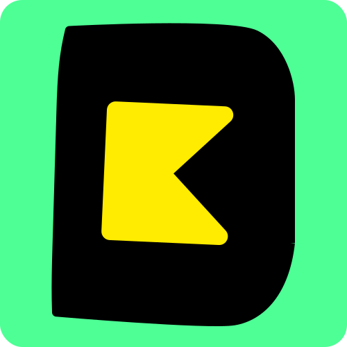

[](https://danger.systems/kotlin/)
[](https://search.maven.org/search?q=g:%22com.r0adkll%22%20AND%20a:%22danger-kotlin-sdk%22)

<p align="center">
</br>
⚠️ Stop saying "you forgot to …" in code review in Kotlin
</p>

# 🚧 Project status 🚧
This project is currently under construction. This was forked from [danger/kotlin](https://github.com/danger/kotlin) to undergo extensive project maintenance and changes that I felt too big to be upstreamed.

---

# Setup
_TBD_

# IntelliJ PLugin
_TBD_

# Github Actions / CI
_TBD_

<!--

### What it looks like today
You can make a `Dangerfile.df.kts` in your root project that looks through PR metadata, it's fully typed.

```kotlin
import systems.danger.kotlin.*

danger(args) {

    val allSourceFiles = git.modifiedFiles + git.createdFiles
    val changelogChanged = allSourceFiles.contains("CHANGELOG.md")
    val sourceChanges = allSourceFiles.firstOrNull { it.contains("src") }

    onGitHub {
        val isTrivial = pullRequest.title.contains("#trivial")

        // Changelog
        if (!isTrivial && !changelogChanged && sourceChanges != null) {
            warn(WordUtils.capitalize("any changes to library code should be reflected in the Changelog.\n\nPlease consider adding a note there and adhere to the [Changelog Guidelines](https://github.com/Moya/contributors/blob/master/Changelog%20Guidelines.md)."))
        }

        // Big PR Check
        if ((pullRequest.additions ?: 0) - (pullRequest.deletions ?: 0) > 300) {
            warn("Big PR, try to keep changes smaller if you can")
        }

        // Work in progress check
        if (pullRequest.title.contains("WIP", false)) {
            warn("PR is classed as Work in Progress")
        }
    }
}
```

### Setup

#### macOS (ARM)
```sh
brew install r0adkll/tap/danger-kotlin
```

#### macOS (Intel)
```sh
brew install r0adkll/tap/danger-kotlin-intel
```

### Linux
```sh
bash <(curl -s https://raw.githubusercontent.com/r0adkll/danger-kotlin/master/scripts/install.sh)
source ~/.bash_profile
```

### GitHub Actions
You can add danger/kotlin to your actions

Parameters:
* `dangerfile`: Path to danger file,  required: `false`,  default: `Dangerfile.df.kts`
* `run-mode`: Run mode: `ci`, `local`, `pr`, required: `false`  default: `ci`
* `job-id:` Reported CI job ID, required: `false`, default: `danger/kotlin`
* `args`: Extra custom arguments like "--failOnErrors --no-publish-check" and etc, required: `false`

```yml
jobs:
  build:
    runs-on: ubuntu-latest
    name: "Run Danger"
    steps:
      - uses: actions/checkout@v4
      - name: Danger
        uses: danger/kotlin@1.3.3
        env:
          GITHUB_TOKEN: ${{ secrets.GITHUB_TOKEN }}
```

Danger a pre built images that you can use with your action:

https://github.com/orgs/danger/packages/container/package/danger-kotlin
In order to import one of those use the docker:// prefix

```yml
jobs:
  build:
    runs-on: ubuntu-latest
    name: "Run Danger"
    container:
      image: docker://ghcr.io/danger/danger-kotlin:1.3.3
    steps:
      - uses: actions/checkout@v4
      - name: Run Danger
        run: danger-kotlin ci --failOnErrors --no-publish-check
        env:
          GITHUB_TOKEN: ${{ secrets.GITHUB_TOKEN }}
```

-->

---

# Authors
`danger-kotlin` was originally developed by [@gianluz][] and [@f-meloni][]
and forked by [@r0adkll][]

[@f-meloni]: https://github.com/f-meloni
[@gianluz]: https://github.com/gianluz
[@r0adkll]: https://github.com/r0adkll
